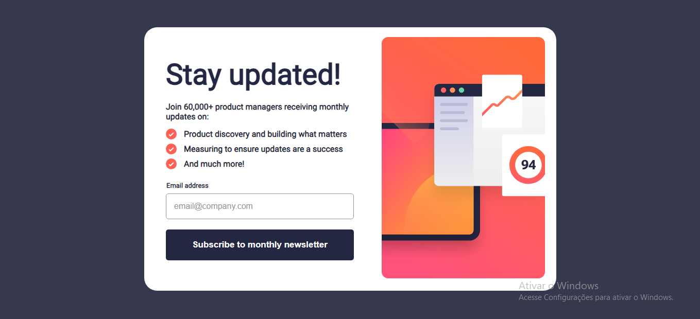
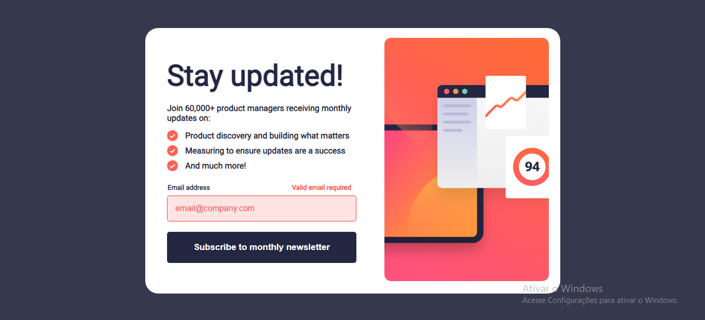
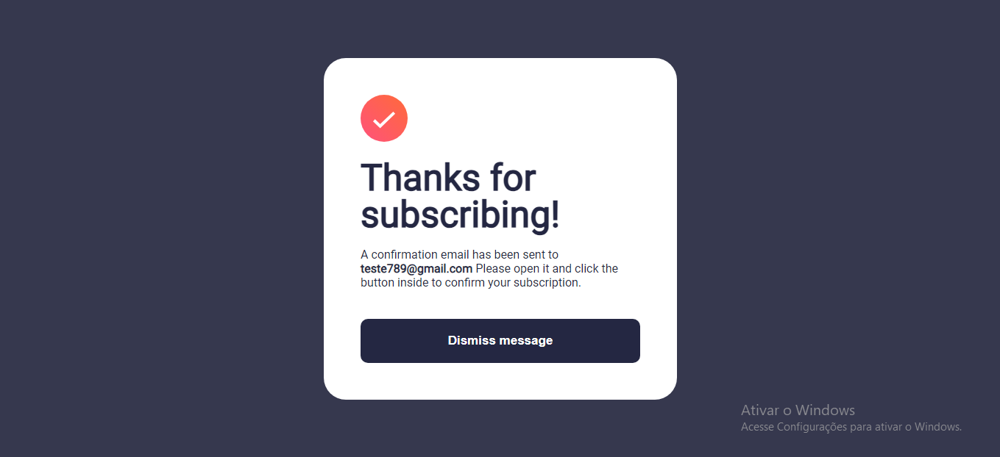

# Frontend Mentor - Newsletter sign-up form with success message solution

This is a solution to the [Newsletter sign-up form with success message challenge on Frontend Mentor](https://www.frontendmentor.io/challenges/newsletter-signup-form-with-success-message-3FC1AZbNrv). Frontend Mentor challenges help you improve your coding skills by building realistic projects. 

## Table of contents

- [Overview](#overview)
  - [The challenge](#the-challenge)
  - [Screenshot](#screenshot)
  - [Links](#links)
- [My process](#my-process)
  - [Built with](#built-with)
  - [What I learned](#what-i-learned)
  - [Continued development](#continued-development)
  - [Useful resources](#useful-resources)
- [Author](#author)

## Overview

### The challenge

Users should be able to:

- Add their email and submit the form
- See a success message with their email after successfully submitting the form
- See form validation messages if:
  - The field is left empty
  - The email address is not formatted correctly
- View the optimal layout for the interface depending on their device's screen size
- See hover and focus states for all interactive elements on the page

Os usuários devem ser capazes de:

- Adicionar o e-mail e enviar o formulário
- Ver uma mensagem de sucesso com o e-mail após enviar o formulário com sucesso
- Ver as mensagens de validação do formulário se:
  - O campo é deixado em branco
  - O endereço de e-mail não está formatado corretamente
- Ver o layout ideal para a interface, dependendo do tamanho da tela do dispositivo
- Ver os estados de foco e foco para todos os elementos interativos na página

### Screenshots





### Links

- Solution URL: [Solution email validation](https://your-solution-url.com)
- Live Site URL: [Email Validation](https://marvin1423.github.io/form-validation/)

## My process

### Built with

- Semantic HTML5 markup
- CSS custom properties
- Flexbox
- Javascript

### What I learned

Trabalhando nesse projeto eu aprendi formas melhores de deixar o site responsivo como o 
```html
<picture>imagem para mobile e imagem para desktop</picture>
```
e bati um pouco a cabeça pra desenvolver o javascript mas deu certo no final

### Continued development

Meus planos atuais são desenvolver o meu Javascript porque ainda tenho bastante dificuldade na hora de desenvolver algo com ele

### Useful resources

- [Como validar um email com JS](https://horadecodar.com.br/como-validar-email-com-javascript/) - Esse site me ajudou a fazer a validação do email com o regex certo pra validá-los

## Author

- Website - [Arthur Marvin](https://github.com/Marvin1423)
- Frontend Mentor - [@Marvin1423](https://www.frontendmentor.io/profile/Marvin1423)
